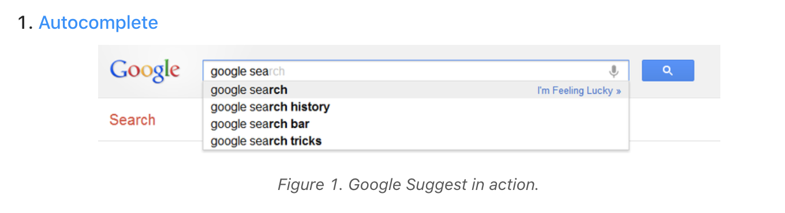
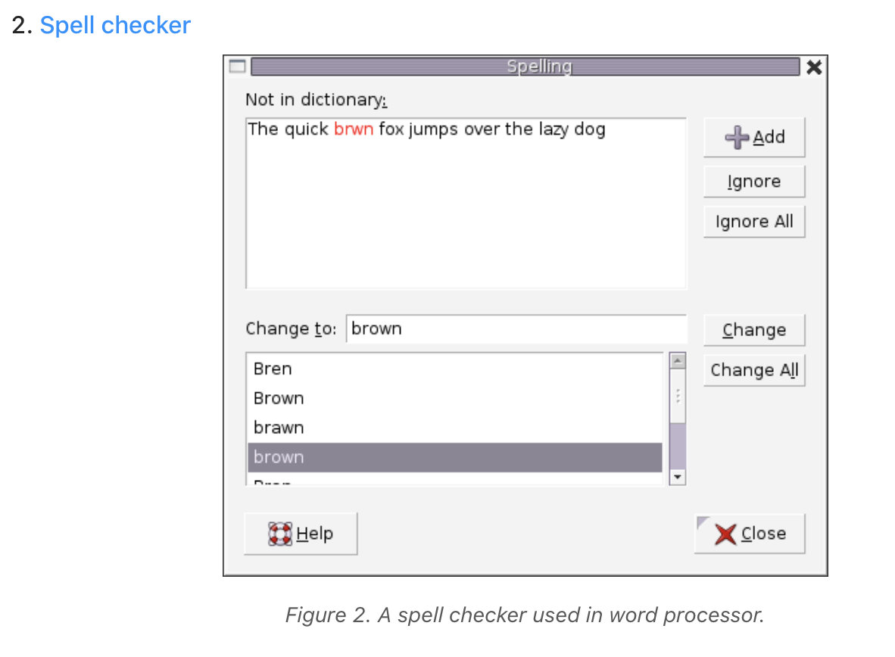
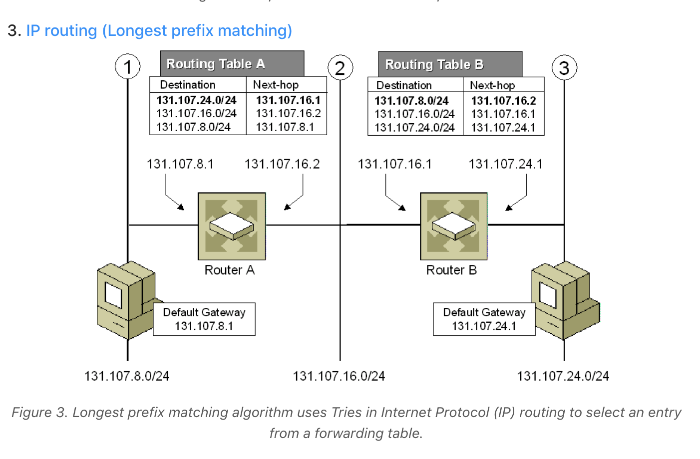
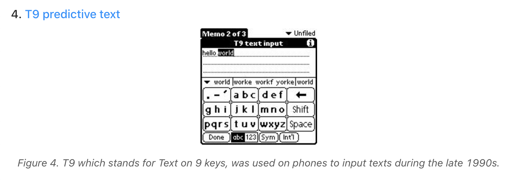
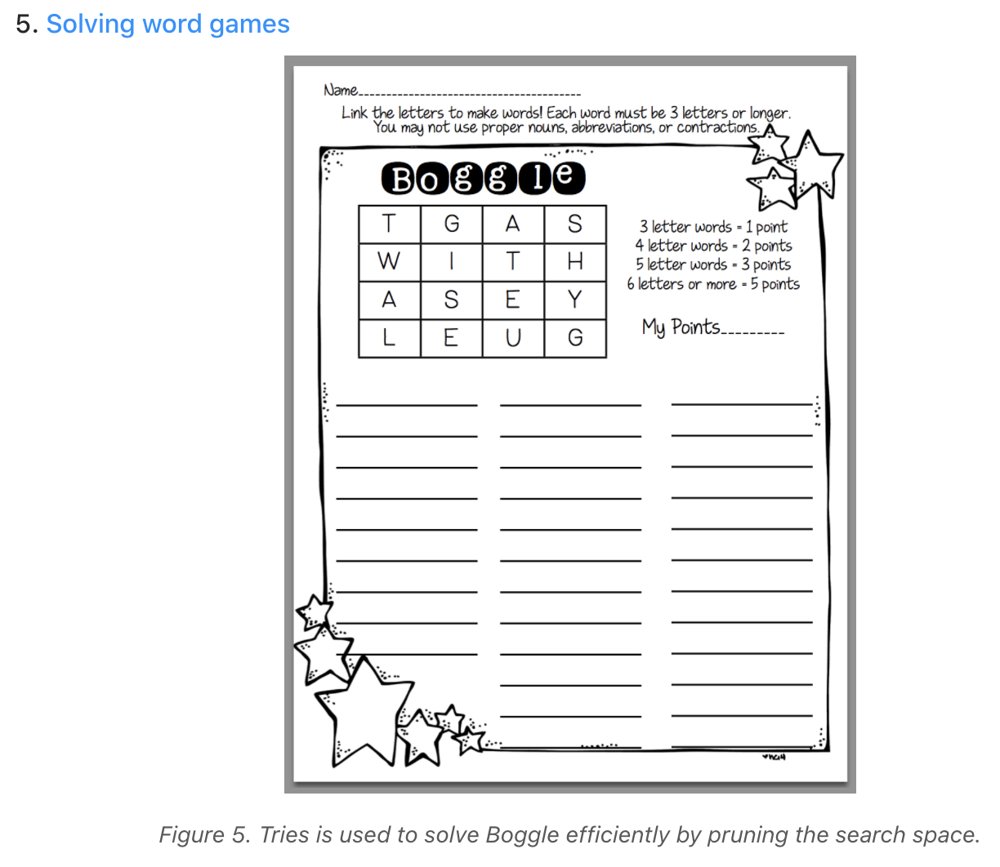
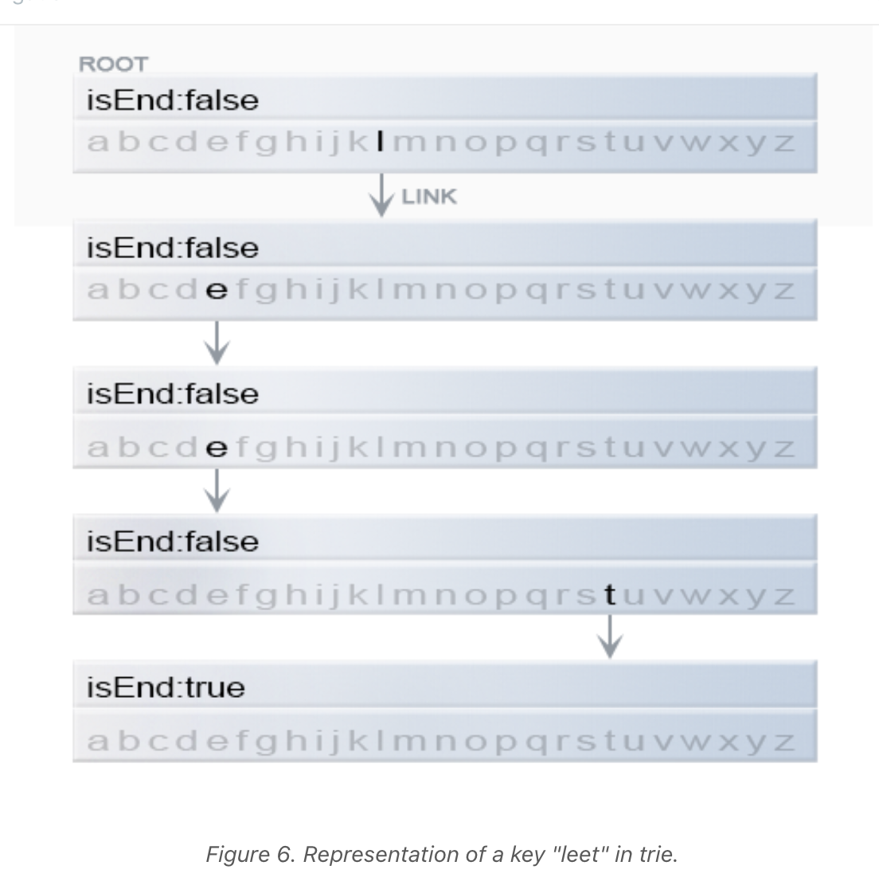
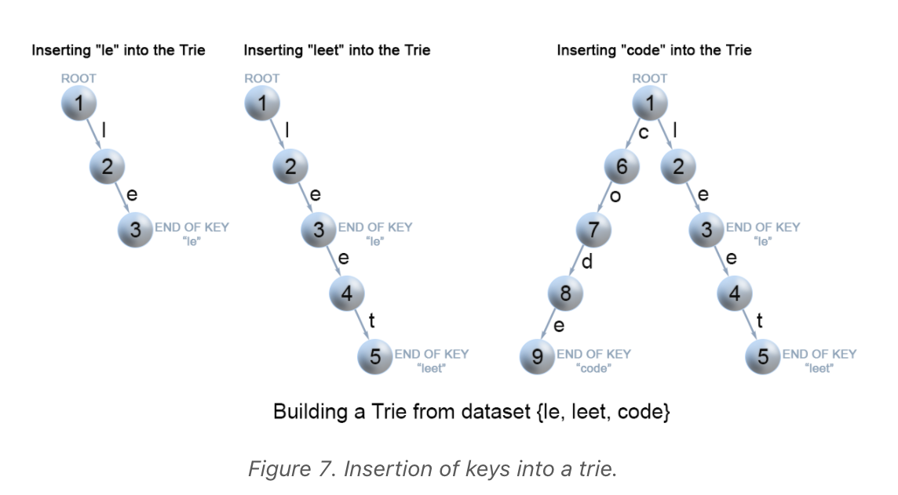
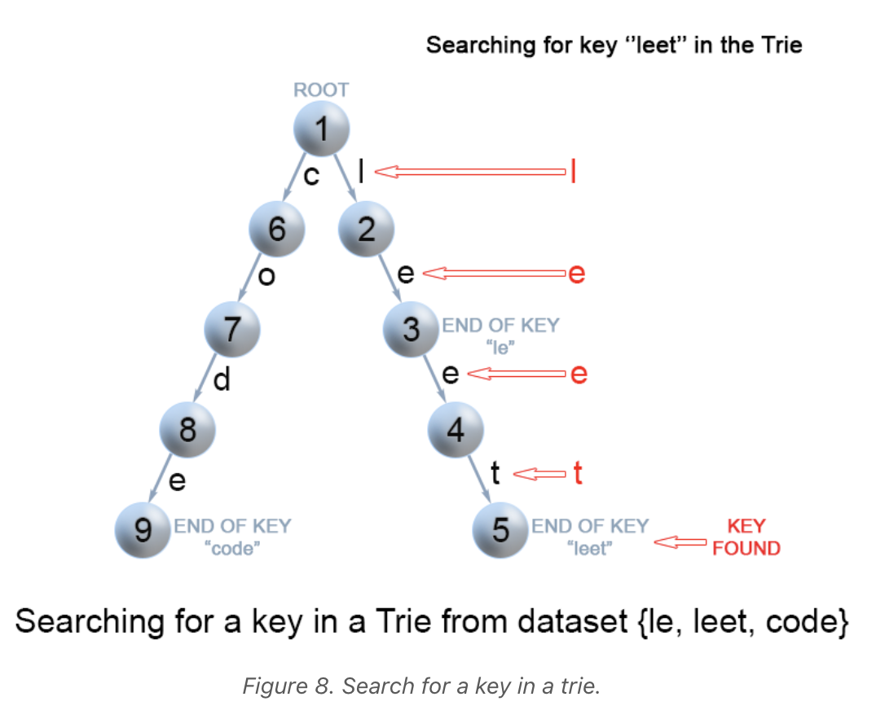
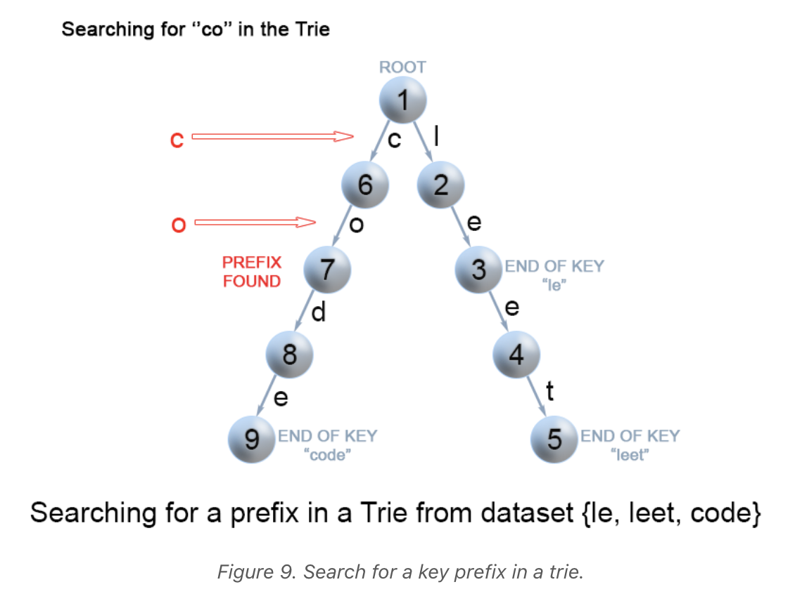
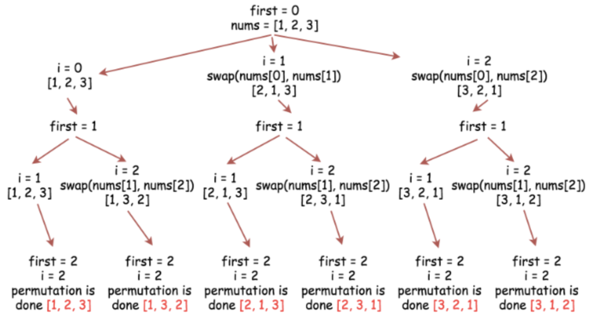

# Algorithms
Algorithm Studies from my Master's in Computer Science. My degree
is from the Georgia Institute of Technology.

## Trie Data Structure
The Trie or prefix tree is a tree data structure we use for retrieval
of a key in a dataset of strings. There are various applications of
this very efficient data structure such as:







This example is especially interesting due to its relevance in
computer networking. The longest prefix matching algorithm is used
by routers in Internet Protocol (IP) networking to select an entry
from a forwarding table. Because each entry in a forwarding table
may specify a sub-network, one destination address may match more
than one forwarding table entry. The most specific of the matching
table entries -- the one with the longest subnet mask -- is called
the longest prefix match. It is called this because it is also the
entry where the largest number of leading address bits of the
destination address match those in the table entry.

An example IPv4 forwarding table:

```
192.168.20.16/28
192.168.0.0/16
```

Suppose the address 192.168.20.19 needs to be looked up. Both of
these entries in the forwarding table "match", meaning both
entries contain the looked up address. The longest prefix of these
two candidate routes is `192.168.20.16/28` because its subnet mask
(/28) is longer than the other entry's mask (/16), making the
router more specific. 





Other data structures, like balanced trees and hash tables, also
give us the ability to search for a word in a dataset of strings.
So why a trie? Even though a hash table has O(1) time complexity
for looking for a key, it is not efficient in the following
operations:
- Finding all keys with a common prefix
- Enumerating a dataset of strings in lexicographical order

Furthermore, as a hash table increases in size, there are lots of
hash collisions, and the search time complexity could deteriorate
to O(N), where *N* is the number of keys inserted. A trie could use
less space compared to a Hash Table when storing many keys with
the same prefix. In this case, employing a trie has only O(M) time
complexity, where *M* is the key length. Also, searching for a key
in a balanced tree costs O(M log M) time.

### Trie Node Structure
A trie is a rooted tree, and its nodes have the following fields
- Maximum of *R* links to its children where each link corresponds
to one of *R* character values from the dataset of an alphabet.
Assume *R* == 26, the number of lowercase latin letters.
- Boolean field which specifies whether the node corresponds to
the end of the key or is just a prefix.



```java
class TrieNode {

    // R links to node children
    private TrieNode[] links;

    private final int R = 26;

    private boolean isEnd;

    public TrieNode() {
        links = new TrieNode[R];
    }

    public boolean containsKey(char ch) {
        return links[ch -'a'] != null;
    }
    public TrieNode get(char ch) {
        return links[ch -'a'];
    }
    public void put(char ch, TrieNode node) {
        links[ch -'a'] = node;
    }
    public void setEnd() {
        isEnd = true;
    }
    public boolean isEnd() {
        return isEnd;
    }
}
```

Two of the most common operations in a trie are insertion of a key
and search for a key.

### Insertion of a Key to a Trie
We insert a key by searching into the trie. First, we visit the
root and search a link. which corresponds to the first key 
character. Two cases will ensue:
- A link exists; therefore, move down the tree following the link
to the next child level. The algorithm continues with searching
for the next key character.
- A link does not exist. We will now create a new node and link
it with the parent's link matching the current key character. This
step will be repeated until we encounter the last character of the
key. At that point, we mark the current node as an end node and the
algorithm completes. 



```java
class Trie {
    private TrieNode root;

    public Trie() {
        root = new TrieNode();
    }

    // Inserts a word into the trie.
    public void insert(String word) {
        TrieNode node = root;
        for (int i = 0; i < word.length(); i++) {
            char currentChar = word.charAt(i);
            if (!node.containsKey(currentChar)) {
                node.put(currentChar, new TrieNode());
            }
            node = node.get(currentChar);
        }
        node.setEnd();
    }
}
```
#### Complexity Analysis
- Time Complexity: O(M) where *M* is the key length
During each iteration of the algorithm, we are either creating or
examining a node in the trie until we reach the end of the key.
This takes only *M* operations.

- Space complexity: O(M)
In the worst case, the newly inserted key does not share a prefix
with the keys already inserted in the trie. We will then have
to add *M* new nodes, which will takes us O(M) space.

### Search for a Key in a Trie

Each key is represented in the trie as a path from the root to the
internal node or leaf. We start from the root with the first key
character, then we examine the current node for a link corresponding
to a key character. There are two cases when searching:
- A link exists; we move to the next node in the path following
this link, and proceed searching for the next key character.
- A link does not exist; if there are no available key characters
and the current node is marked as `isEnd`, we return true. Otherwise,
there are two more possible cases where we return false:
    - There are key characters left, but it is impossible to follow
    the key path in the trie, and the key is missing.
    - No key characters are left, but the current node is not marked
    as isEnd. Therefore, the search key is only a prefix of another
    key in the trie.



```java
class Trie {
    ...

    // search a prefix or whole key in trie and
    // returns the node where search ends
    private TrieNode searchPrefix(String word) {
        TrieNode node = root;
        for (int i = 0; i < word.length(); i++) {
           char curLetter = word.charAt(i);
           if (node.containsKey(curLetter)) {
               node = node.get(curLetter);
           } else {
               return null;
           }
        }
        return node;
    }

    // Returns if the word is in the trie.
    public boolean search(String word) {
       TrieNode node = searchPrefix(word);
       return node != null && node.isEnd();
    }
}
```
#### Complexity Analysis
- Time Complexity: O(M) - In each step of the algorithm, we search
for the next key character. In the worst case, the algorithm
performs *M* operations.
- Space Complexity: O(1)

### Search for a Key Prefix in a Trie
Similar to searching a key in a trie, we traverse the trie from
the root until there are no characters left in the key prefix or
it is impossible to continue the path in the trie with the current
key character. The only difference is that when we come to an end of
the key prefix, we always return true. We do not need to consider
the boolean `isEnd` because we are searching for a prefix of a key,
not a whole key.



```java
class Trie {
    ...

    // Returns if there is any word in the trie
    // that starts with the given prefix.
    public boolean startsWith(String prefix) {
        TrieNode node = searchPrefix(prefix);
        return node != null;
    }
}
```
#### Complexity Analysis
- Time Complexity: O(M)
- Space Complexity: O(1)

## Permutations
For a certain Georgia Tech project in which we were tasked
to consider all permutations of an input, I found the algorithm
to generate these test cases quite clever. Through my studies,
I discovered the approach of **backtracking**.

**Backtracking** is an algorithm for finding all solutions by exploring
all potential candidates. If the solution candidate turns out to not
be a solution, then the algorithm will discard it by making some changes
on the previous step. These *changes on the previous step* are the 
backtracking idea to this algorithmic approach.

Imagine the problem space where you are given a distinct integer array
and must create all possible permutations of this array. An example
of such an array is [1,2,3]. A backtrack function that takes the index
of the first integer to consider as an argument would work as follows:
- If the first integer to consider has index `n`, that means that the
current permutation is done.
- Iterate over the integers from index `first` to index `n-1`.
    - Place the `i`-th integer first in the permutation, i.e.
    `swap(nums[first], nums[i])`
    - Proceed to create all permutations which start from the `i`-th
    integer: `backtrack(first + 1)`
    - Now, backtrack, i.e. `swap(nums[first], nums[i])` back
    


## Kadane's Algorithm
Imagine this problem space:
Given a circular array C of integers represented by A,
find the maximum possible sum of a non-empty subarray of C.

Here, a circular array means the end of the array connects to
the beginning of the array.  (Formally, C[i] = A[i] when 0 <= i
< A.length, and C[i+A.length] = C[i] when i >= 0.)

Also, a subarray may only include each element of the fixed
buffer A at most once.  (Formally, for a subarray C[i], C[i+1],
..., C[j], there does not exist i <= k1, k2 <= j with k1 % A.length
= k2 % A.length.) 

Example 1:
```
Input: [1,-2,3,-2]
Output: 3
Explanation: Subarray [3] has maximum sum 3
```
Example 2:

```
Input: [5,-3,5]
Output: 10
Explanation: Subarray [5,5] has maximum sum 5 + 5 = 10
```
Example 3:
```
Input: [3,-1,2,-1]
Output: 4
Explanation: Subarray [2,-1,3] has maximum sum 2 + (-1) + 3 = 4
```
Example 4:
```
Input: [3,-2,2,-3]
Output: 3
Explanation: Subarray [3] and [3,-2,2] both have maximum sum 3
```
Example 5:
```
Input: [-2,-3,-1]
Output: -1
Explanation: Subarray [-1] has maximum sum -1
```

To understand the solutions for this problem, I found it best to
explore Kadane's algorithm. The algorithm can be used to find the
maximum sum of the subarrays of an array `A`. The algorithm is
based on dynamic programming. Let `dp[j]` be the maximum sum of a
subarray that ends in `A[j]`. For example, `dp[j] = max(A[i] + 
A[i+1] + ... + A[j])`

Therefore, a sum ending in `j+1` maximized the `A[i] + ... + A[j]` part
of the sum by being equal to `dp[j]` if it is non-empty, and 0 if
it is.

`dp[j+1] = A[j+1] + max(dp[j],0)`. The maximum element of dp[j] will
be the desired answer here. 

Now, how do we compute `dp` efficiently? We will maintain two variables
to reduce space complexity: `ans` as the max(dp[j]) and `cur` as the 
current dp[j] we are computing. We update these variables as `j` iterates
from 0 to `A.length - 1`.

The following pseudocode explains the approach well:
```
#Kadane's algorithm
ans = cur = None
for x in A:
    cur = x + max(cur, 0)
    ans = max(ans, cur)
return ans
```

### Approach: Next Array
Subarrays of circular arrays can be classified as either a *one-interval*
subarray or a *two-interval* subarray. For example, if A = [0, 1, 2, 3, 4, 5, 6] 
is the underlying buffer of our circular array, we could represent
the subarray [2, 3, 4] as one interval [2,4], but we would
represent the subarray [5, 6, 0, 1] as two intervals [5,6],[0,1].

Via Kidane's algorithm, we know how to get the maximum of one-interval
subarrays, so it only remains to consider two-interval subarrays. The
code looks like the following:

```java
class Solution {
    public int maxSubarraySumCircular(int[] A) {
        int N = A.length;

        int ans = A[0], cur = A[0];
        for (int i = 1; i < N; ++i) {
            cur = A[i] + Math.max(cur, 0);
            ans = Math.max(ans, cur);
        }

        // ans is the answer for 1-interval subarrays.
        // Now, let's consider all 2-interval subarrays.
        // For each i, we want to know
        // the maximum of sum(A[j:]) with j >= i+2

        // rightsums[i] = A[i] + A[i+1] + ... + A[N-1]
        int[] rightsums = new int[N];
        rightsums[N-1] = A[N-1];
        for (int i = N-2; i >= 0; --i)
            rightsums[i] = rightsums[i+1] + A[i];

        // maxright[i] = max_{j >= i} rightsums[j]
        int[] maxright = new int[N];
        maxright[N-1] = A[N-1];
        for (int i = N-2; i >= 0; --i)
            maxright[i] = Math.max(maxright[i+1], rightsums[i]);

        int leftsum = 0;
        for (int i = 0; i < N-2; ++i) {
            leftsum += A[i];
            ans = Math.max(ans, leftsum + maxright[i+2]);
        }

        return ans;
    }
}
```